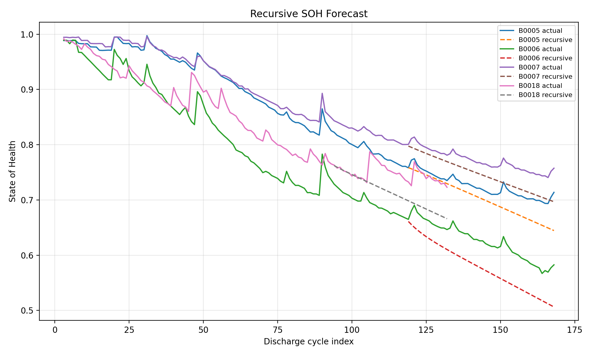
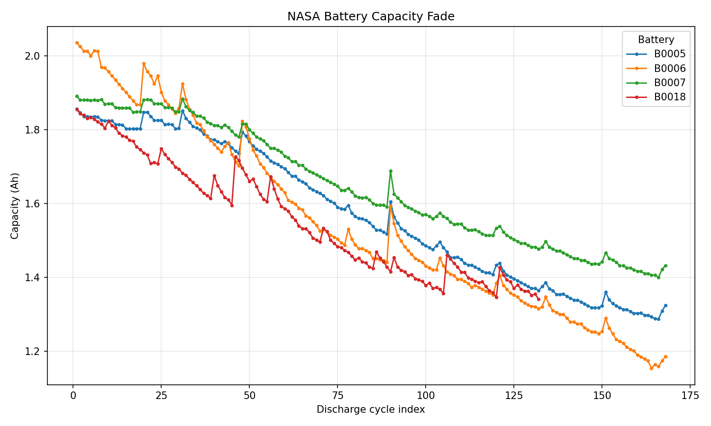
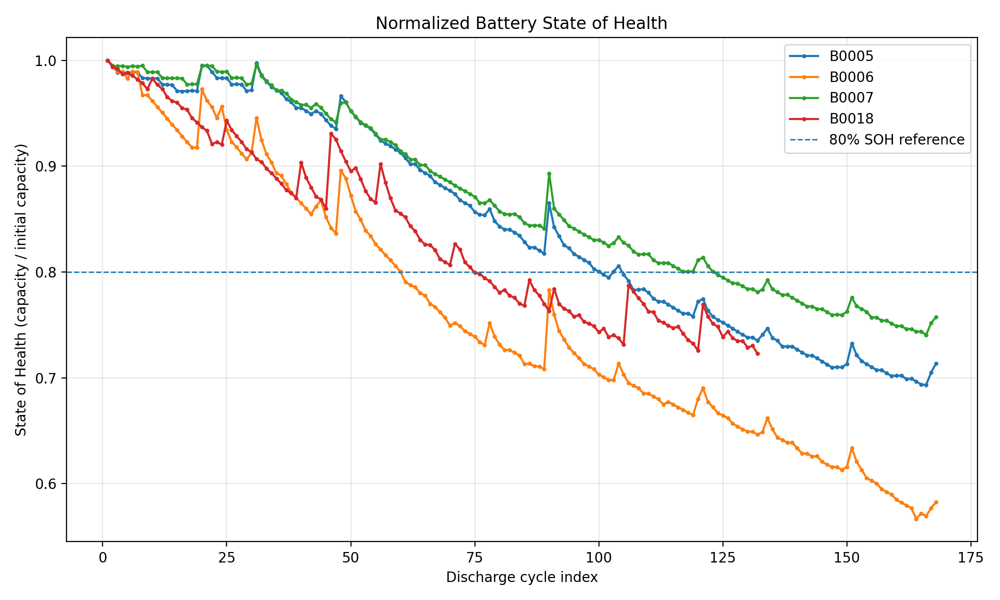
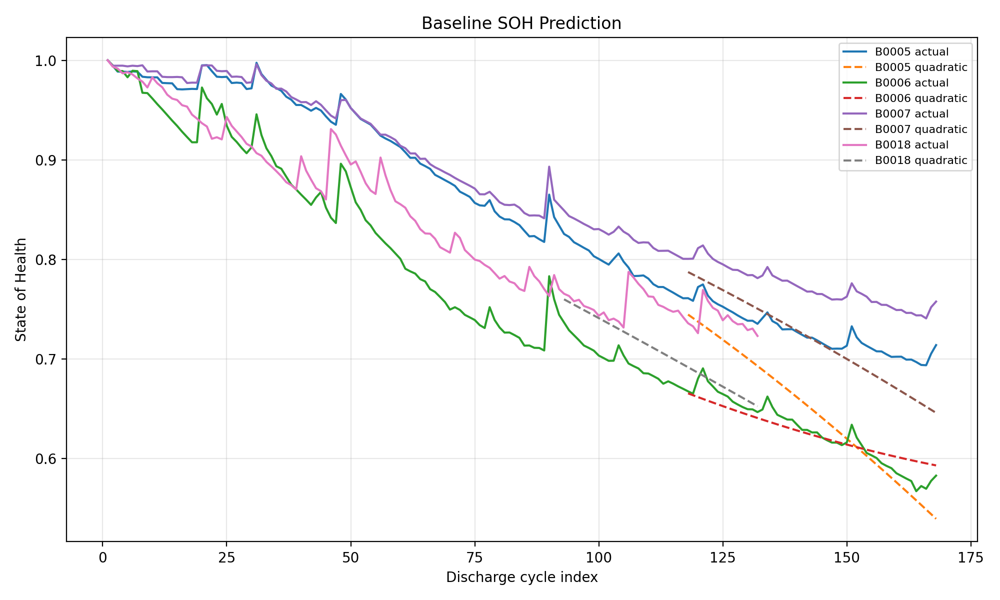
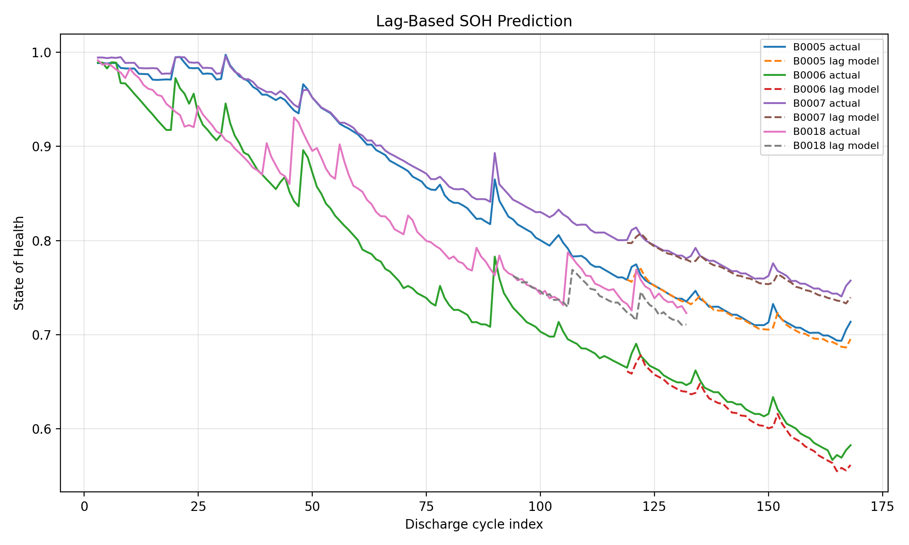
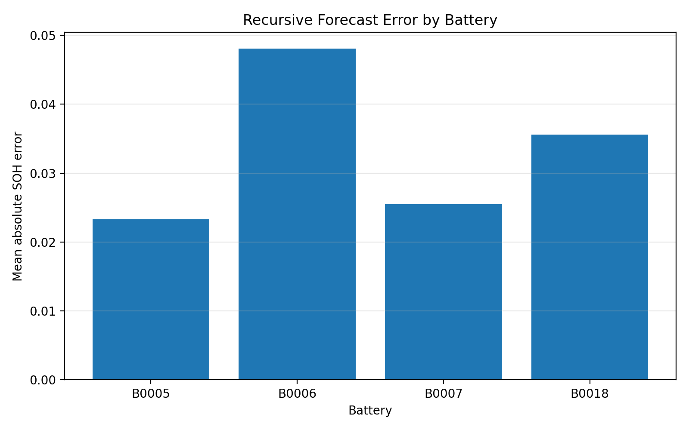
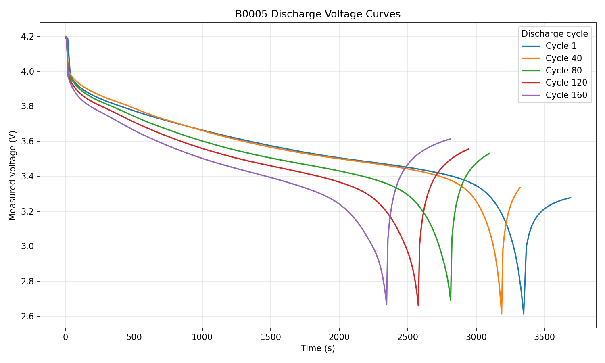

# Battery Health Forecasting Baselines

This repository analyzes capacity fade and state-of-health (SOH) forecasting on four cells from the NASA Li-ion Battery Aging Dataset.

The main result is a gap between one-step prediction and free-running forecasting. A lag-based linear model reaches an average MAE of `0.0078` when the previous observed SOH values are available, but its recursive version reaches `0.0331`, effectively matching the `0.0323` naive baseline. Feeding predictions back into the model exposes the drift hidden by the easier one-step setup.

The current implementation is a data-driven baseline. It does **not** yet include a physics-guided constraint, remaining-useful-life estimator, or hardware logger.

## Key Forecasting Result

All models use the first 70% of each battery's cycles for training and the final 30% for testing.

| Evaluation | Test-time information | Average MAE | Average RMSE |
|---|---|---:|---:|
| Naive last observed | Last SOH from the training window | `0.0323` | `0.0376` |
| One-step lag linear | Observed SOH from preceding test cycles | `0.0078` | `0.0105` |
| Recursive lag linear | Its own previous predictions | `0.0331` | `0.0375` |

The one-step result is useful for sequential monitoring when the previous cycle has already been measured. It is not evidence of accurate long-horizon forecasting. The recursive evaluation is the stricter test because no observed future SOH value is fed back after forecasting begins.



## Dataset

The analysis uses cells `B0005`, `B0006`, `B0007`, and `B0018` from the [NASA Prognostics Center of Excellence Battery Data Set](https://www.nasa.gov/intelligent-systems-division/discovery-and-systems-health/pcoe/pcoe-data-set-repository/). NASA provides the [complete battery dataset download](https://phm-datasets.s3.amazonaws.com/NASA/5.+Battery+Data+Set.zip).

Dataset citation:

> B. Saha and K. Goebel (2007). “Battery Data Set”, NASA Prognostics Data Repository, NASA Ames Research Center, Moffett Field, CA.

Raw MATLAB files are not tracked in this repository. The public processed table contains 636 discharge cycles and is available at:

```text
data/processed/discharge_capacity.csv
```

Its columns are:

- `battery_id`
- `cycle_index`
- `discharge_index`
- `ambient_temperature`
- `capacity_ah`
- `num_samples`

SOH is defined independently for each cell as:

```text
SOH = measured discharge capacity / first measured discharge capacity
```

## Capacity Degradation

The four cells show different degradation trajectories, including local capacity recovery in some cycles.



| Battery | Discharge cycles | Final SOH | Capacity drop |
|---|---:|---:|---:|
| `B0005` | 168 | `0.7138` | `28.62%` |
| `B0006` | 168 | `0.5825` | `41.75%` |
| `B0007` | 168 | `0.7575` | `24.25%` |
| `B0018` | 132 | `0.7229` | `27.71%` |

`B0006` has the largest relative capacity loss in this subset.



## Modeling Stages

### Cycle-index baselines

The first comparison uses only discharge-cycle index:

- `naive_last_observed` repeats the final SOH value in the training window;
- `quadratic_polynomial` extrapolates a degree-2 trend.

The naive model performs better on average:

| Model | Average MAE | Average RMSE |
|---|---:|---:|
| Naive last observed | `0.0330` | `0.0386` |
| Quadratic polynomial | `0.0467` | `0.0532` |

The slight difference between this naive result and the `0.0323` value in the forecasting table comes from dropping the first two cycles when lag features are constructed.



### One-step lag model

The lag model uses:

- `discharge_index`
- `soh_lag_1`
- `soh_lag_2`

It is evaluated with observed lag values inside the test window and therefore represents one-step prediction, not an open-loop multi-step forecast.



### Recursive forecast and drift

The recursive model begins with the final two observed training values, then feeds each prediction into the next step. Its average MAE rises to `0.0331`.

`B0006` has the largest mean recursive absolute error at `0.0481`. For `B0005` and `B0007`, the largest error occurs at the final test cycle, illustrating accumulated forecast drift.



Detailed metrics and prediction tables are stored under `results/`.

## Discharge Voltage Example

The raw `B0005` data are also used to compare measured voltage curves at discharge cycles 1, 40, 80, 120, and 160. Later cycles have shorter discharge trajectories and sustain voltage for less time.



This figure requires the original `B0005.mat` file to regenerate; the cycle-level forecasting pipeline does not.

## Reproducing the Public Pipeline

Create a virtual environment and install the dependencies:

```bash
python3 -m venv .venv
source .venv/bin/activate
python -m pip install --upgrade pip
python -m pip install -r requirements.txt
```

The tracked processed table is sufficient for the public downstream analysis:

```bash
python src/plot_capacity_fade.py
python src/plot_normalized_soh.py
python src/train_baseline_soh_model.py
python src/train_lag_soh_model.py
python src/train_recursive_soh_forecast.py
python src/analyze_recursive_forecast_errors.py
```

To reproduce the raw-data extraction and voltage-curve figure, download the official NASA archive, place the relevant `.mat` files anywhere under `data/raw/`, and run:

```bash
python src/inspect_raw_battery_data.py
python src/extract_discharge_capacity.py
```

For the voltage-curve script, place `B0005.mat` at:

```text
data/raw/nasa_battery/arc_fy08q4/B0005.mat
```

Then run:

```bash
python src/plot_discharge_voltage_curves.py
```

## Limitations

- Evaluation is within each battery; cross-battery generalization has not been tested.
- The one-step lag result uses observed previous-cycle SOH values in the test window.
- The recursive forecast uses only cycle index and SOH history; it does not use voltage, current, temperature, or impedance features.
- All four cells in the processed subset have an ambient-temperature value of `24°C`, so temperature effects cannot be evaluated here.
- No physics-guided loss, monotonic constraint, electrochemical model, or uncertainty estimate is implemented yet.
- Remaining useful life is not estimated.
- The documented Arduino logger is a future extension, not a completed experiment or battery-management system.

## Possible Next Work

- evaluate leave-one-battery-out or other cross-cell splits;
- add physically meaningful cycle features from voltage, current, temperature, or impedance;
- compare unconstrained predictions with a defensible monotonic or bounded formulation;
- evaluate forecast error as a function of horizon;
- add hardware logging only after real measurements are available.

The optional hardware concept is documented in [`docs/hardware_logging_plan.md`](docs/hardware_logging_plan.md).

## Repository Structure

```text
data/processed/  Public cycle-level capacity table
data/raw/        Ignored location for original NASA MATLAB files
docs/            Dataset, loading, roadmap, and optional hardware notes
results/         Metrics, predictions, summaries, and figures
src/             Extraction, visualization, modeling, and evaluation scripts
```
