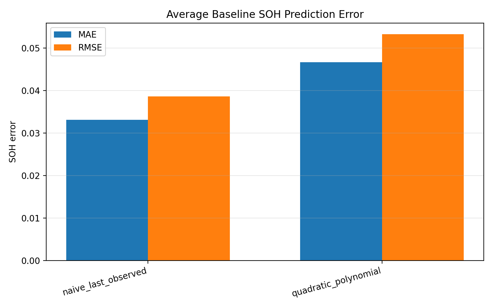
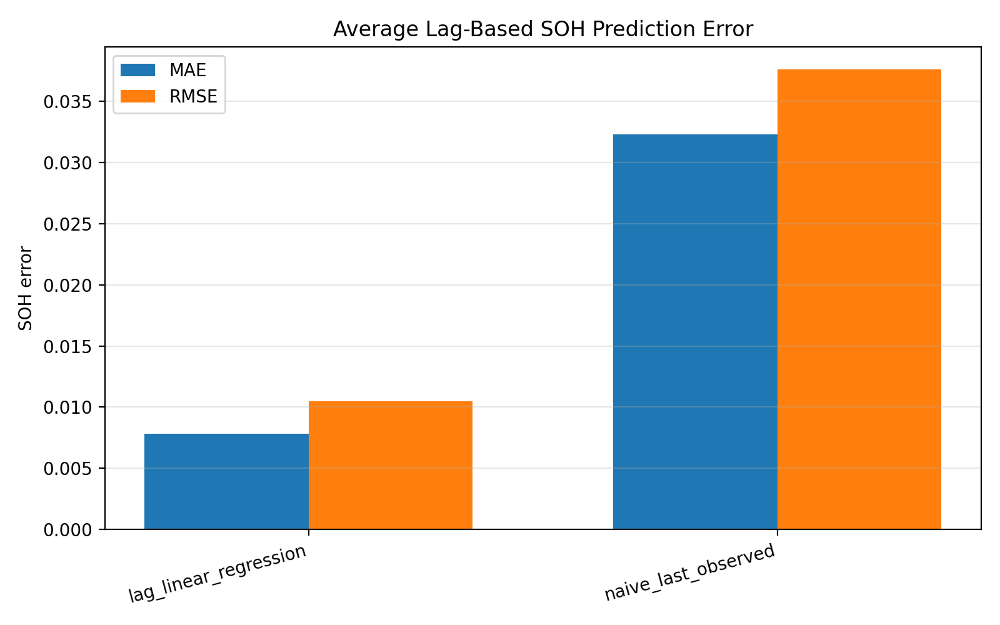
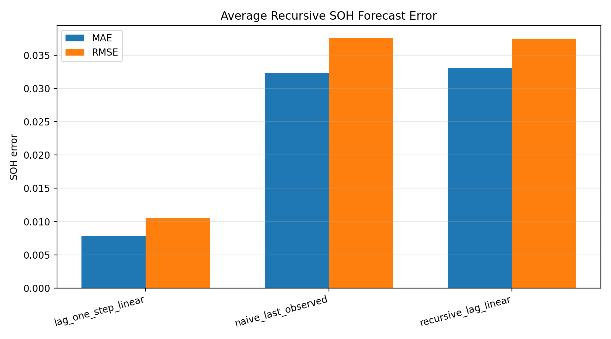

# Physics-Guided Battery Health Estimation

This project is planned as a physics-guided machine learning project for battery health and remaining useful life estimation.

The goal is to start with a real public battery aging dataset, build clear visual analysis, train baseline models, and then test whether physics-guided constraints can make the predictions more reliable.

This is not a finished battery management system yet. The first version will focus on data loading, visualization, baseline modeling, and honest evaluation.

## First Results

The first processed dataset in this repository is built from the NASA battery aging files `B0005`, `B0006`, `B0007`, and `B0018`.

So far, the project extracts discharge-cycle capacity values and visualizes capacity fade across cycles.

Current processed table:

- `data/processed/discharge_capacity.csv`

Current result files:

- `results/capacity_fade.png`
- `results/capacity_fade_summary.txt`
- `results/normalized_soh.png`
- `results/normalized_soh_summary.txt`
- `results/b0005_discharge_voltage_curves.png`
- `results/baseline_soh_prediction.png`
- `results/baseline_soh_metric_comparison.png`
- `results/baseline_soh_metrics.txt`
- `results/baseline_soh_predictions.csv`
- `results/lag_soh_prediction.png`
- `results/lag_soh_metric_comparison.png`
- `results/lag_soh_metrics.txt`
- `results/lag_soh_predictions.csv`
- `results/recursive_soh_forecast.png`
- `results/recursive_soh_forecast_metric_comparison.png`
- `results/recursive_soh_forecast_metrics.txt`
- `results/recursive_soh_forecast_predictions.csv`
- `results/recursive_forecast_error_analysis.txt`
- `results/recursive_forecast_error_analysis.csv`
- `results/recursive_forecast_error_by_battery.png`

### Capacity Fade Plot

### Normalized State of Health Plot

The project also normalizes each cell's capacity by its first discharge capacity:

`SOH = capacity / initial capacity`

This makes the degradation trend easier to compare across cells, even when their absolute starting capacities are slightly different.

Result files:

- `results/normalized_soh.png`
- `results/normalized_soh_summary.txt`

In the current subset, `B0006` falls the fastest and ends at about `0.5825` SOH after 168 discharge cycles.

### Discharge Voltage Curve Example

The repository also includes an example discharge-voltage visualization for `B0005`.

This plot compares several discharge cycles from early, middle, and later life:

- cycle 1
- cycle 40
- cycle 80
- cycle 120
- cycle 160

Result file:

- `results/b0005_discharge_voltage_curves.png`

This figure makes the degradation behavior more concrete than a single capacity table. Later cycles show a shorter discharge trajectory and lower voltage sustain compared with earlier cycles.

### Baseline SOH Prediction

The first modeling step is a simple later-cycle SOH prediction baseline.

For each battery, the first 70% of discharge cycles are used for training and the last 30% are used for testing. This is an in-cell extrapolation setup, not a cross-battery generalization test.

Two simple baselines are compared:

- `naive_last_observed`: repeats the last SOH value seen during training
- `quadratic_polynomial`: fits a degree-2 trend from discharge cycle index to SOH

Result files:

- `results/baseline_soh_prediction.png`
- `results/baseline_soh_metric_comparison.png`
- `results/baseline_soh_metrics.txt`
- `results/baseline_soh_predictions.csv`

In this first test, the naive baseline is stronger on average:

- `naive_last_observed`: MAE = 0.0330, RMSE = 0.0386
- `quadratic_polynomial`: MAE = 0.0467, RMSE = 0.0532

This is a useful early result because it shows that a smoother trend model is not automatically better than a simple baseline. The next modeling step should compare stronger features or constraints against this naive reference.

### Lag-Based SOH Prediction

A second modeling step uses lag features from the SOH history:

- `discharge_index`
- `soh_lag_1`
- `soh_lag_2`
- `capacity_lag_1`

This test predicts later-cycle SOH using observed lag features from nearby previous cycles. It should be read as a one-step lag-feature test, not as a recursive multi-step forecast.

Result files:

- `results/lag_soh_prediction.png`
- `results/lag_soh_metric_comparison.png`
- `results/lag_soh_metrics.txt`
- `results/lag_soh_predictions.csv`

In this setup, the lag-based linear model improves over the last-observed baseline:

- `lag_linear_regression`: MAE = 0.0078, RMSE = 0.0105
- `naive_last_observed`: MAE = 0.0323, RMSE = 0.0376

This result is useful because it shows that recent SOH history carries more information than cycle index alone. The next step should be stricter forecasting, where future lag values are not assumed to be observed.

### Recursive SOH Forecast

The next test makes the lag-based setup stricter.

The earlier lag model uses observed lag values inside the test window. This script adds a recursive forecast where the model must feed its own predicted SOH values back into the next step.

Result files:

- `results/recursive_soh_forecast.png`
- `results/recursive_soh_forecast_metric_comparison.png`
- `results/recursive_soh_forecast_metrics.txt`
- `results/recursive_soh_forecast_predictions.csv`

Average test metrics:

- `lag_one_step_linear`: MAE = 0.0078, RMSE = 0.0105
- `naive_last_observed`: MAE = 0.0323, RMSE = 0.0376
- `recursive_lag_linear`: MAE = 0.0331, RMSE = 0.0375

The recursive model is much less accurate than the one-step lag model and ends up close to the naive baseline. This is an important result: using observed future lag values makes the task easier, while recursive forecasting exposes accumulated prediction error.

### Recursive Forecast Error Analysis

The recursive forecast is also checked for drift across the test window.

Result files:

- `results/recursive_forecast_error_analysis.txt`
- `results/recursive_forecast_error_analysis.csv`
- `results/recursive_forecast_error_by_battery.png`

In this run, `B0006` has the largest average recursive drift with a mean absolute SOH error of `0.0481`. For `B0005` and `B0007`, the largest recursive error occurs at the final test cycle, which supports the idea that prediction error can accumulate over a recursive forecast horizon.

### Capacity Fade Summary

From the first four batteries:

- `B0005`: capacity drop ≈ 28.62%
- `B0006`: capacity drop ≈ 41.75%
- `B0007`: capacity drop ≈ 24.25%
- `B0018`: capacity drop ≈ 27.71%

Among these four cells, `B0006` shows the largest relative capacity loss in the current subset.

The project now includes both data visualization and baseline SOH forecasting. The recursive forecast result is kept in the README because it shows a useful limitation: one-step lag prediction looks strong, but recursive forecasting is much harder once the model must feed its own predictions forward.

## Planned Direction

The next useful steps are:

1. keep the recursive forecast results as the honest modeling baseline
2. test better features or monotonic constraints without overstating the result
3. add a small Arduino-based hardware logging extension
4. use real voltage/current/temperature logs as a limited physical comparison layer
5. keep the project framed as battery health analysis, not a production BMS

## Why This Project Fits My Portfolio

This project connects machine learning with a real physical degradation process.

It fits my broader direction in intelligent physical systems because it combines:

- time-series sensor data
- physical system behavior
- degradation modeling
- machine learning
- interpretable evaluation
- possible embedded data logging in a later version

## Planned Visual Results

The repository now includes several core result figures:

- capacity fade curves
- normalized SOH curves
- discharge-voltage curve comparison
- baseline SOH prediction plots
- lag-based SOH prediction plots
- recursive forecast plots
- recursive forecast error plots

Future plots may include voltage, current, power, and temperature curves from the hardware logger.

## Planned Hardware Extension

A later hardware version is planned around simple Arduino-based battery logging.

Planned hardware:

- Arduino UNO R3
- INA226 voltage/current monitor
- DS18B20 temperature sensor
- TP4056/TC4056 charger and protection module
- single 18650 battery holder
- 18650 Li-ion cell
- 27 ohm and 10 ohm cement load resistors

The hardware extension is documented here:

- [`docs/hardware_logging_plan.md`](docs/hardware_logging_plan.md)

This extension is meant for short voltage/current/temperature logging experiments. It is not a production battery management system, a controlled battery cycler, or an accurate SOH estimator from a few short tests.

## Current Status

Implemented so far:

- NASA battery `.mat` file inspection
- discharge capacity extraction
- capacity fade visualization
- normalized SOH visualization
- example discharge-voltage curve comparison for `B0005`
- baseline later-cycle SOH prediction
- lag-based one-step SOH prediction
- recursive multi-step SOH forecasting
- recursive forecast drift analysis
- hardware logging plan

Next step:

- add the Arduino logger skeleton after the hardware parts are ready
